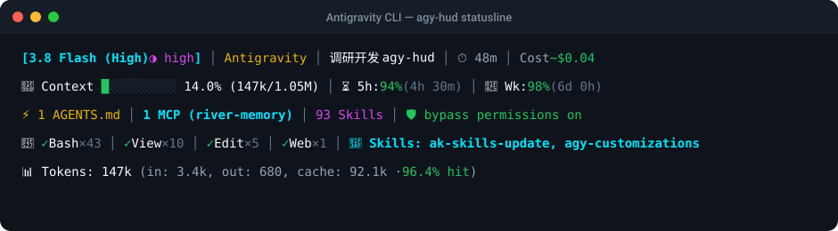

# 🚀 AGY-HUD

**专为 Google Antigravity CLI (`agy`) 打造的高密度实时状态栏（Statusline HUD）**

参考 Claude-HUD 的全景信息架构设计，以极低的系统开销（< 20ms、零外部依赖）在终端输入框下方实时呈现当前会话的模型、花费、上下文容量、工具执行统计与环境资产。

[English](README.md) | [中文文档](README_zh.md)

<p align="center">
  
</p>

---

## ✨ 核心特性

- 💰 **实时 Token 费用估算**：根据当前模型（Gemini 3.8/3.5/Pro 等）与会话累积消耗，精准计算美元花费（自动计算 Prompt Cache 缓存折扣）。
- 🔧 **工具调用战报**：实时统计当前会话执行的命令（`✓ Bash ×43`）、读取文件（`✓ View ×10`）、编辑文件（`✓ Edit ×5`）等调用次数。
- 🎯 **Skill 调用感知**：自动捕获 Agent 在当前对话中触发加载的技能（如 `ak-skills-update`、`agy-customizations`）。
- 🧠 **上下文占用进度条**：直观展示已用 Token、总容量与占用百分比（`14.0% (147k/1.05M)`），随水位自动切换绿、黄、红三级警示色。
- ⏳ **双配额滚动追踪**：实时监控 5 小时会话配额与 7 天周配额，清晰展示重置倒计时（如 `94% (4h 30m)`）。
- ⚡ **环境资产一览**：自动识别当前工程挂载的规则文件（如 `AGENTS.md`）、已加载的 MCP 服务（如 `river-memory`）、Skills 数量与权限旁路状态。
- 📊 **Token 吞吐明细**：详细呈现每轮对话的输入、输出、Cache 命中量及缓存命中率。
- 🪶 **极速零依赖**：基于 Python 3 标准库构建，无需安装任何 npm 包或 pip 依赖，跨平台即装即用。

---

## 🖥️ 布局模式（4 种形态自由切换）

AGY-HUD 支持在 `config.json` 中一键切换 4 种预设模式：

### 1. 完整全景模式 (`full`，默认推荐)
展示全部 5 行信息，信息最全、掌控感最强：
```text
[3.8 Flash (High) ◑ high] │ Antigravity │ 调研开发 agy-hud │ ⏱ 48m │ Cost ~$0.04
🧠 Context █░░░░░░░░░ 14.0% (147k/1.05M) │ ⏳ 5h: 94% (4h 30m) │ 📅 Wk: 98% (6d 0h)
⚡ 1 AGENTS.md │ 1 MCP (river-memory) │ 93 Skills │ 🛡️ bypass permissions on
🔧 ✓ Bash ×43 │ ✓ View ×10 │ ✓ Edit ×5 │ ✓ Web ×1 │ 🎯 Skills: ak-skills-update
📊 Tokens: 147k (in: 3.4k, out: 680, cache: 92.1k · 96.4% hit)
```

### 2. 标准平衡模式 (`standard`)
保留核心 Header、上下文配额与工具战报（共 3 行）：
```text
[3.8 Flash (High) ◑ high] │ Antigravity │ 调研开发 agy-hud │ ⏱ 48m │ Cost ~$0.04
🧠 Context █░░░░░░░░░ 14.0% (147k/1.05M) │ ⏳ 5h: 94% (4h 30m) │ 📅 Wk: 98% (6d 0h)
🔧 ✓ Bash ×43 │ ✓ View ×10 │ ✓ Edit ×5 │ 🎯 Skills: ak-skills-update
```

### 3. 经典双行模式 (`compact`)
适合喜欢更窄状态栏的用户（共 2 行）：
```text
🤖 3.8 Flash (High) │ 📁 agy-hud │ 🌿 main │ ⚡ working
🧠 Context █░░░░░░░░░ 14.0% (147k/1.05M) │ ⏳ 5h: 94% (4h 30m) │ 📅 Wk: 98% (6d 0h) │ ~$0.04
```

### 4. 极简单行模式 (`minimal`)
单行极窄展示：
```text
🤖 3.8 Flash (High) │ 🧠 █░░░░░░░ 14% │ ⚡ working
```

---

## ⚡ 快速安装与使用

### 一键安装

进入项目目录后，直接运行安装脚本即可完成配置：

```bash
cd /Users/boo/Projects/0xAiKang/agy-hud
python3 install.py
```

该脚本会自动：
1. 备份你现有的 `~/.gemini/antigravity-cli/settings.json`。
2. 写入 `statusLine` 配置，指向本地的 `statusline.py`。
3. 立即运行预览并确认生效。

### 终端测试与预览

无需重启 Antigravity，即可在终端快速预览不同布局的效果：

```bash
# 预览当前默认模式
python3 statusline.py --preview

# 预览特定模式 (full / standard / compact / minimal)
python3 statusline.py --preview standard
python3 statusline.py --preview compact
python3 statusline.py --preview minimal
```

---

## ⚙️ 自由配置 (`config.json`)

在项目根目录下创建或编辑 `config.json`（可参考 [`config.example.json`](config.example.json)）：

```json
{
  "mode": "full",
  "show_header": true,
  "show_context": true,
  "show_quotas": true,
  "show_assets": true,
  "show_tools": true,
  "show_tokens": true,
  "show_cost": true,
  "show_duration": true,
  "show_skills": true,
  "progress_bar_width": 10,
  "cost_currency": "$"
}
```

- **`mode`**: 可选 `"full"`、`"standard"`、`"compact"`、`"minimal"`。
- **细粒度开关**: 每一行与每一个指标（费用、时长、Skill、工具计数等）均支持单独通过 `true/false` 开关。

---

## 🗑️ 卸载

如需恢复默认或移除状态栏配置：

```bash
python3 install.py --uninstall
```

---

## 📄 开源许可

本项目基于 [MIT License](LICENSE) 开源，原项目衍生自 [doraemonkeys/agy-statusline](https://github.com/doraemonkeys/agy-statusline)。
